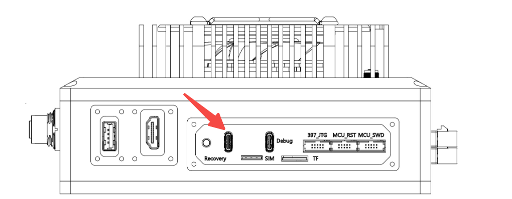
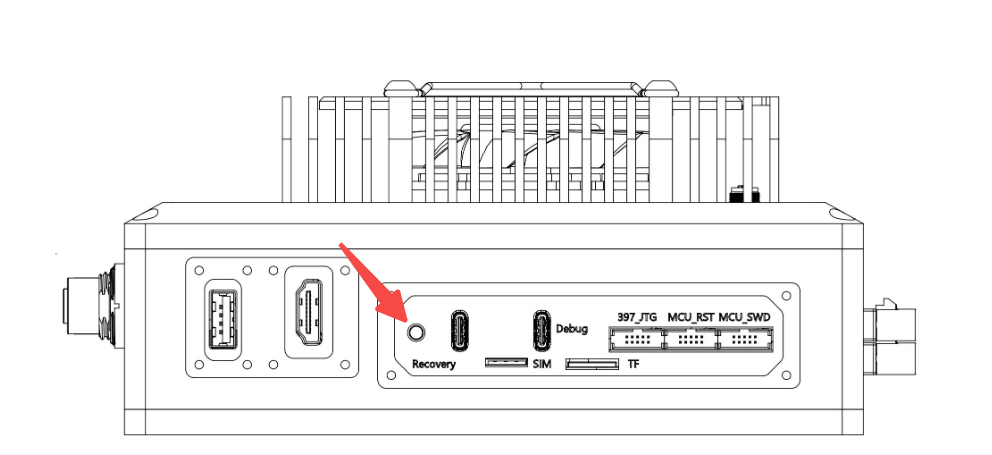

# Raytol DCU Software Download

This repository provides the software versions for Raytol's DCU, the flashing methods, and some application demos.

## DCU Release System Package

| Product name  | Supported Cameras            |  Jetson Linux Versions | Download Link |
|---------------|------------------------------|------------------------|---------------|
| RB-1 (64G)    | Sensing_isx031,sensing_ar0233,leopard_isx031,tier4_isx021,tier4_imx490,leopard_gm2b_isx031   | 35.3.1                 | [Download Link](http://ag-to-public.oss-cn-shanghai.aliyuncs.com/RB-1/V1.0/35.3/64G/images.tar.gz) |
| RB-1 (32G)    | Sensing_isx031,sensing_ar0233,leopard_isx031,tier4_isx021,tier4_imx490,leopard_gm2b_isx031   | 35.3.1                 | TBD|
| RB-1 (64G)    | Sensing_isx031,sensing_ar0233,leopard_isx031,tier4_isx021,tier4_imx490,leopard_gm2b_isx031   | 36.4.4                 | TBD|
| RB-1 (32G)    | Sensing_isx031,sensing_ar0233,leopard_isx031,tier4_isx021,tier4_imx490,leopard_gm2b_isx031   | 36.4.4                 | TBD|
| RB-0 (64G)    | Sensing_isx031,sensing_ar0233,leopard_isx031,tier4_isx021,tier4_imx490,leopard_gm2b_isx031   | 35.3.1                 | TBD|
| RB-0 (32G)    | Sensing_isx031,sensing_ar0233,leopard_isx031,tier4_isx021,tier4_imx490,leopard_gm2b_isx031   | 35.3.1                 | TBD|
| RB-0 (64G)    | Sensing_isx031,sensing_ar0233,leopard_isx031,tier4_isx021,tier4_imx490,leopard_gm2b_isx031   | 36.4.4                 | TBD|
| RB-0 (32G)    | Sensing_isx031,sensing_ar0233,leopard_isx031,tier4_isx021,tier4_imx490,leopard_gm2b_isx031   | 36.4.4                 | TBD|

## Flashing DCU Steps

1. **Prepare the Environment**
   - Prepare a ubuntu22.04 pc as your host machine.
   - Download the Flash tools with this [link](http://ag-to-public.oss-cn-shanghai.aliyuncs.com/Flash_tools/Linux_for_Tegra.tar.gz) and extract the flash tools.
   ```bash
   tar -xzvf Linux_for_Tegra.tar.gz
   ```
   - Install flash requirements
   ```bash
    cd Linux_for_Tegra
    sudo ./tools/l4t_flash_prerequisites.sh
    sudo service nfs-kernel-server start
   ```
2. **Download the Release Package**
   - Use the links provided in the table above to download the appropriate The Release Package.
   - Extract the Release Package and move to the flash Path.
   ```bash
   tar -xzvf $TheReleasePackage
   mv $TheReleasePackage $(The path of Linux_For_Tegra)/Linux_for_Tegra/tools/backup_restore/
   ```
3. **Connect the Device**
   - Connect the DCU to the host machine via USB.

   

   - Hold the recovery button and power on the device. Release it after 5 seconds

   

   - If the connection is successful, you will see the following content. 

   

4. **Flash the Device**
   - Use the following command to flash the DCU.
    ```bash
    cd Linux_for_Tegra
    sudo ./tools/backup_restore/l4t_backup_restore.sh -r jetson-agx-orin-devkit
    ```

<!-- 5. **Verify the Flash**
   - Ensure the device boots correctly and verify the flashed version. -->

## Some Application Repositories

| Repository | Description |
|------------|-------------|
| [Ros2_v4l2](https://github.com/Raytol-crg/Ros2_CameraDemo) | Ros2 v4l2 demo appliction |
